# 🔥🔥 Custom Paint Animations 

This project contains a collection of **Flutter UI kits**, **animations**, and **CustomPaint** demos.

## Run the project

This repo ships with a built-in **demo catalog** (search + navigation).

- Run on a simulator/device, then pick a demo from the list.

## ✨ Requirements

* Any Operating System (ie. MacOS X, Linux, Windows)
* Any IDE with Flutter SDK installed (ie. IntelliJ, Android Studio, VSCode etc)
* A little knowledge of Dart and Flutter

## Screenshots & Gifs

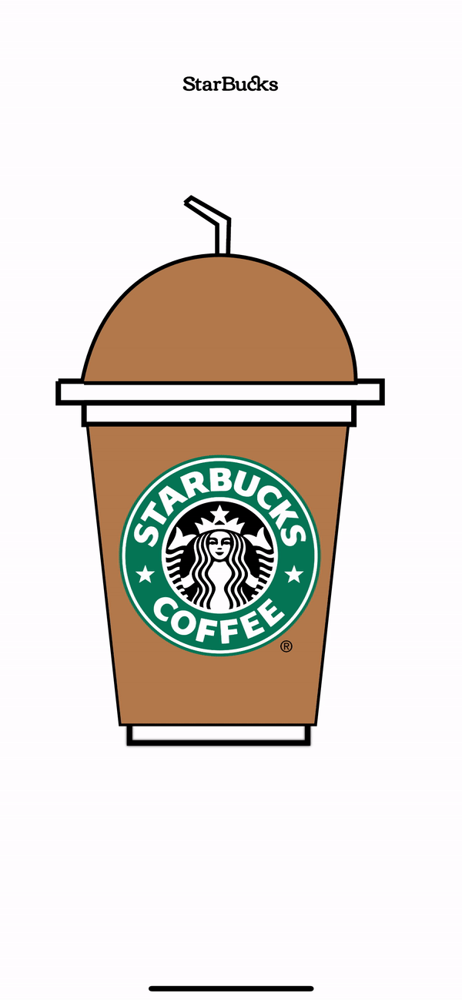 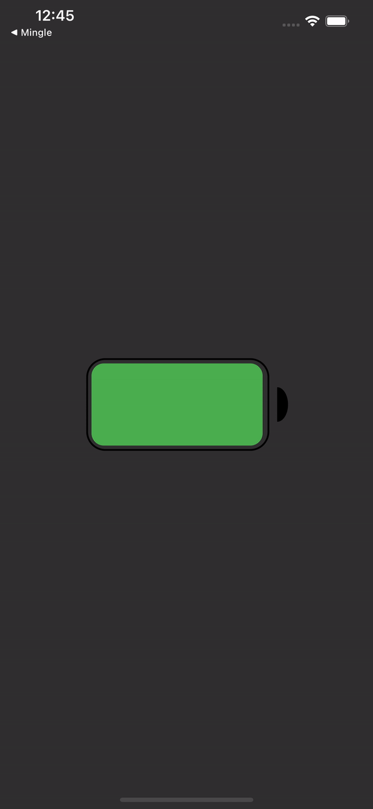 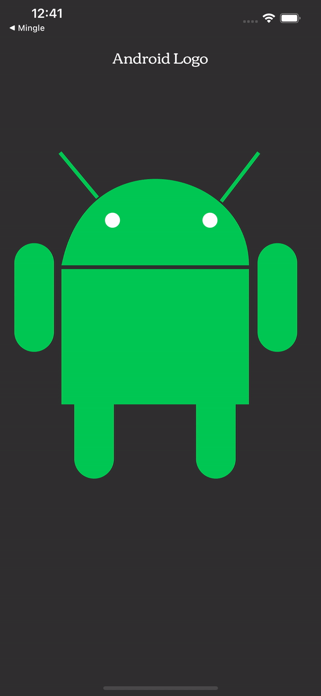

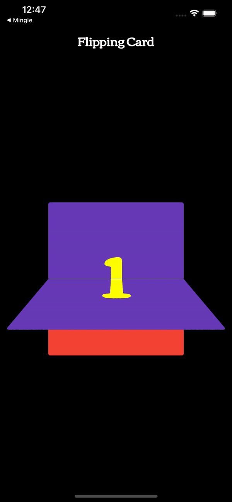 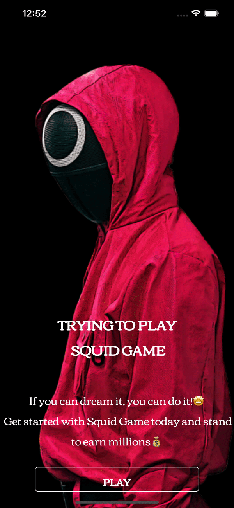 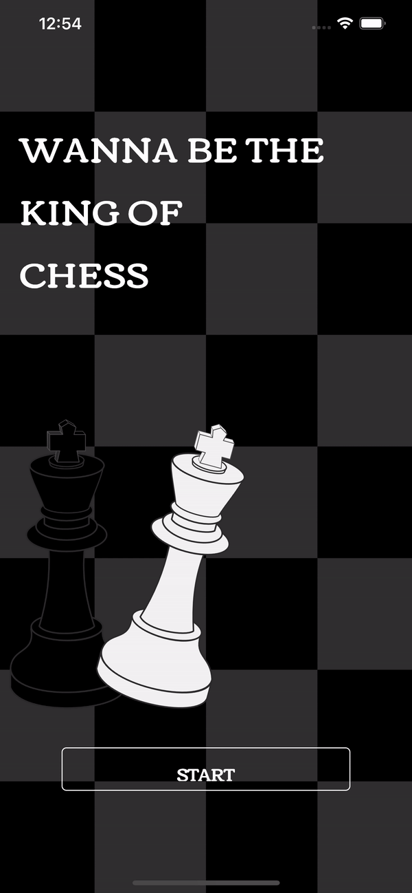

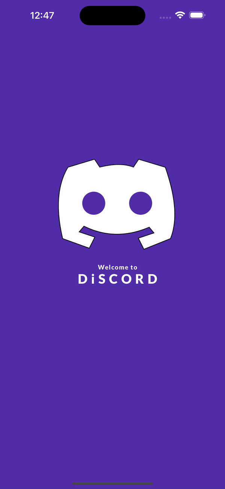 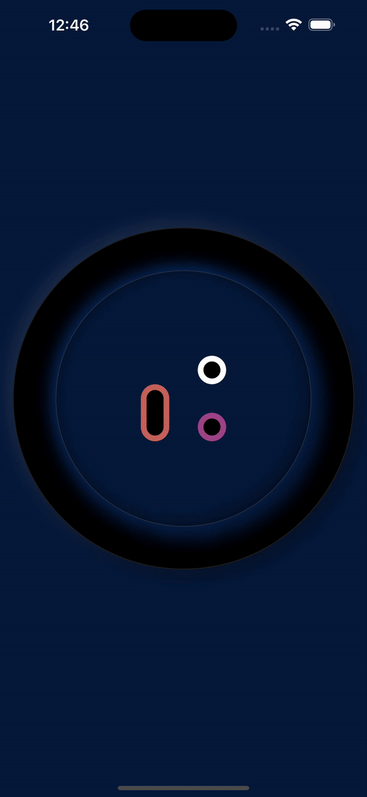 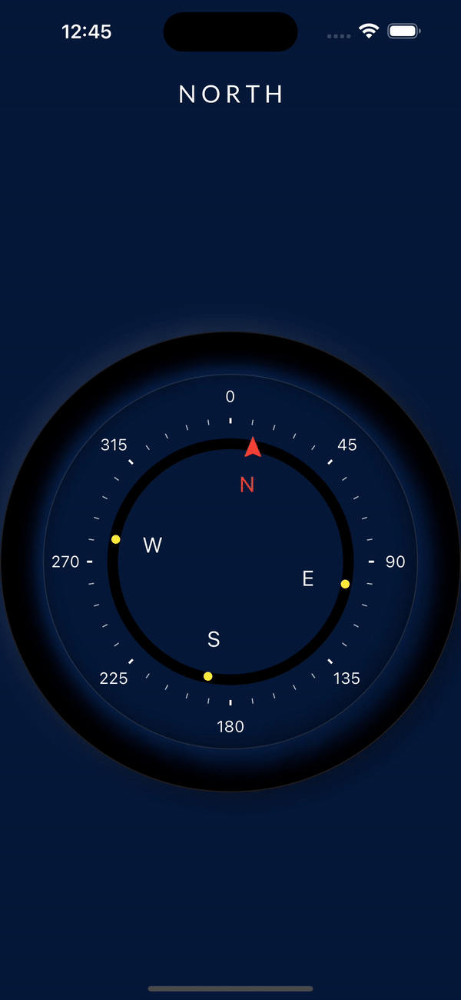

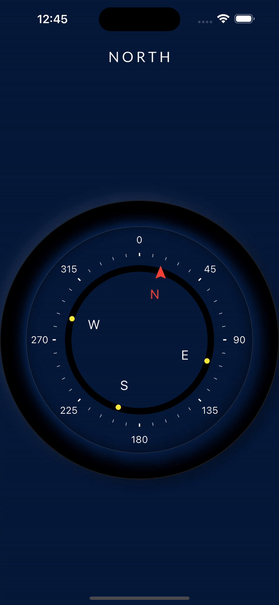 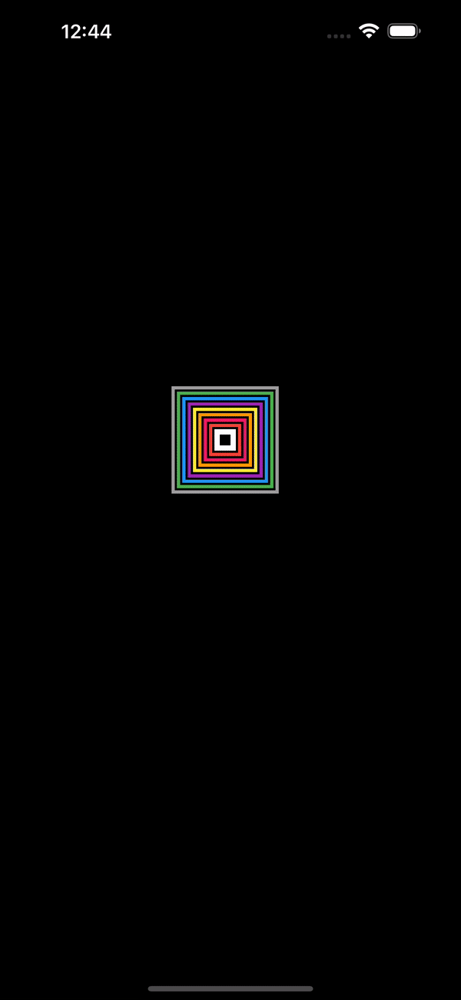 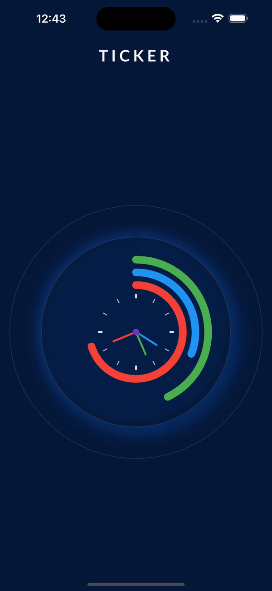 

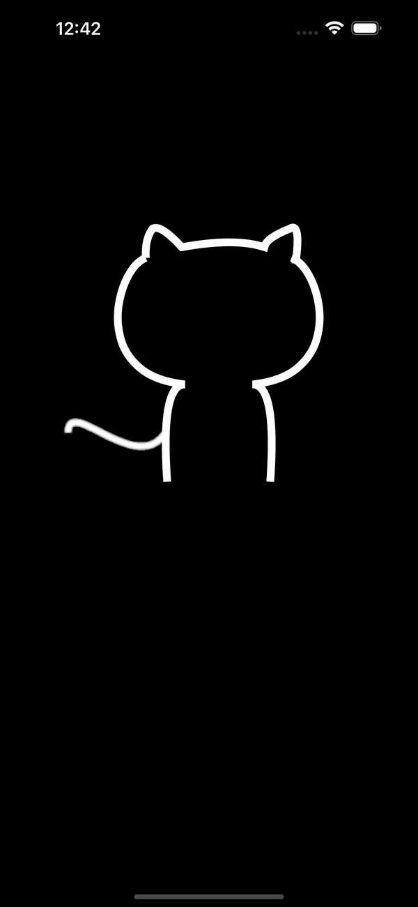 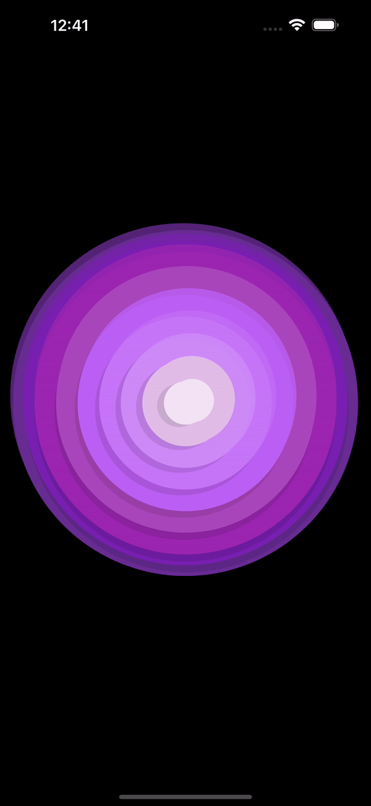 

## Contributing

See `CONTRIBUTING.md` for repo conventions and how to add a new demo.

## 🤓 Author(s)

**
CharlyKeleb** 
